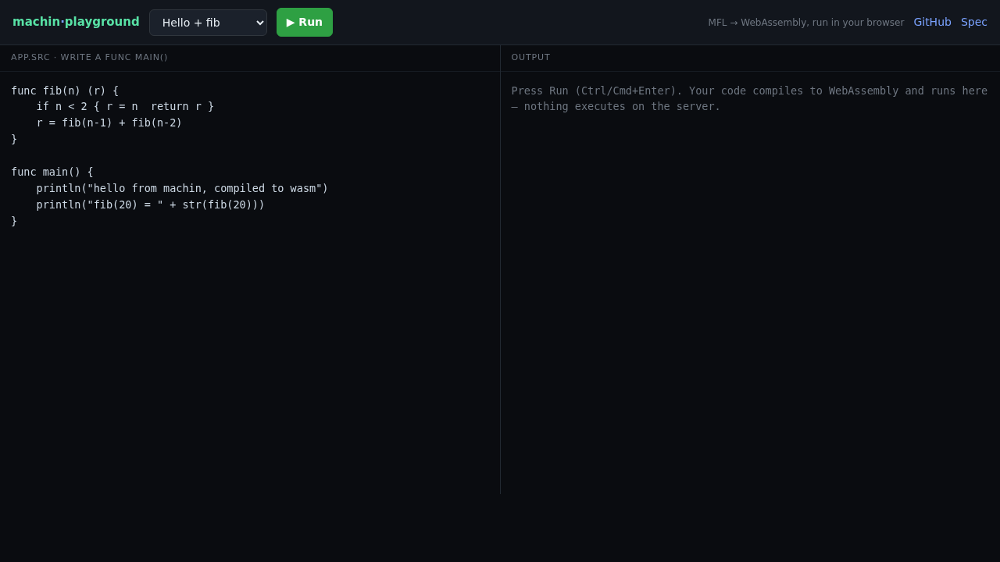

# machin-playground

**Try [machin](https://github.com/javimosch/machin) (MFL) in your browser** — write
code, hit Run, see it execute. No install, no C compiler on your machine.

### ▶ Live: **[play.intrane.fr](https://play.intrane.fr)**



The whole thing is **one machin binary** (machweb) that serves the editor page and a
`/compile` endpoint — a dogfood of machin's own deploy story.

## How it works

```
[ editor page ]                              [ /compile (machin) ]
 textarea + Run   ──POST your MFL source──▶   machin encode → build --target wasm
 a Web Worker runs the wasm in-browser  ◀── wasm module ──   (size cap, no FFI, timeouts)
 println output → the output panel
```

- **Your code runs in the browser's own wasm sandbox**, not on the server — so the
  service never executes user code. It only *compiles* (bounded: ≤24 KB source, no
  `extern`/FFI, `timeout` on `machin`+`zig`). Compilation produces a `wasm32-wasi`
  reactor module; the page runs it with a ~30-line WASI shim that captures stdout.
- The wasm runs in a **Web Worker terminated after 5 s**, so an infinite loop can't
  hang the tab.
- **v1 is compute + `println`** — fib, generics, closures, structs, JSON, string ops.
  Net / SQLite need a host the browser-wasm can't provide, so those stay a "deploy
  it" story (that's what the [main repo](https://github.com/javimosch/machin) is for).

## Run it

```bash
./build.sh                 # needs machin + a C compiler
PORT=8080 ./playground     # also needs `machin` and `zig` on PATH (it shells out to them)
# open http://localhost:8080
```

Or with Docker (builds machin from source + bundles zig):

```bash
docker build -t machin-playground . && docker run -p 8080:8080 machin-playground
```

## Built with machin

`app.src` (the compile service + routing) and `ui.src` (the editor + WASI runner)
compose against `framework/machweb.src`. Building it surfaced and fixed a real machin
gap — wasm reactor modules now flush stdout, so `println` output isn't lost
([machin#274](https://github.com/javimosch/machin/pull/274)).

## License

MIT — Javier Leandro Arancibia. Built with [machin](https://github.com/javimosch/machin).
